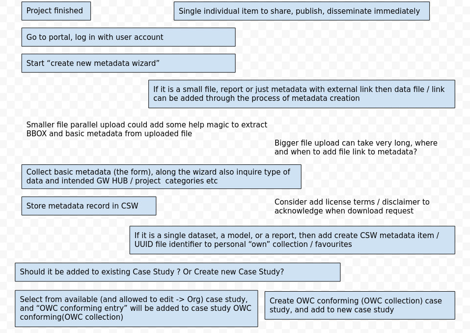

.. _usecases:

Detailed descriptions of the functionality
==========================================

.. _#UserAuth:

#UserAuth
---------

.. _uc1:

#1 - Login Screen
  Summary: Anonymous user can login using a login screen providing username and password.

.. _uc2:

#2 - Log-off Button
  Summary: Authenticated user can log-off using a "logout button".

.. _uc3:

#3 - Update profile
  Summary: Authenticated users can change / provide user information (profile)

.. _uc4:

#4 - Change password
  Summary: Authenticated users can change their password

.. _uc5:

#5 - Reset password
  Summary: Anonymous but registered users can reset their password by providing their username / email address

.. _uc6:

#6 - Register account
  Summary: Anonymous users can register an account

.. _uc7:

#7 - Anonymous users can register and login using Google OAuth2
  Summary: Summary: By clicking on the Google Sign In buttun, users login and will have a local account created and linked to their Google identity.
  Reference: https://developers.google.com/identity/protocols/OAuth2

.. _#CSWIndexing:

#CSWIndexing
------------

.. _uc10:

#10 - Lucene/Angular Google type search and display underpinning all searches/discovery paths
  Summary: All search queries, the categories/icons dashboard menus or the free search form with the map,
  are built upon a specialised query syntax: the Lucene query syntax. To forge specific queries you can employ following fields:

  - `keywords`: classic keyword in the sense that datasets, articles, reports or models are tagged with keywords describing the content
  - `title`: The title of the dataset, report, article or model
  - `abstrakt`: Intentional typo, as "abstract" is a reserved word in most programming languages, apologies for the inconvenience. We mean the abstract, or exec summary type of brief description at
    the top of reports and research articles.
  - `smartCategory`: a specific keyword type for this portal, which is from a controlled list to improve visibility in the portal. The
    list is was generated: 2017-04-19 from Excel GW portal list of icons new structure 20170317.xlsx / Worksheet: science domain categories
  - `topicCategory`: one of the ISO/ANZLIC TopicCategory values for MD_Metadata:
    `environment`, `inlandWaters`, `geoscientificInformation`, `farming`, `biota`, `boundaries`,
    `climatologyMeteorologyAtmosphere`, `oceans`, `imageryBaseMapsEarthCover`, `location`, `economy`, `elevation`,
    `health`, `society`, `planningCadastre`, `structure`, `transportation`, `utilitiesCommunication`, `intelligenceMilitary`
  - `contactName`: The name of a contact person associated with the record. Beyond beinf point of contact this person could also be
    have one or more of the roles author, publisher, owner, originator, processor or principal investigator (the role type is not indexed by itself)
  - `contactOrg`: The organisation of the contact person for the record
  - `contactEmail`: The email address of the contact person for the record
  - `license`: The license text associated with the record.
  - `lineageStmt`: The liniage statement for the record, could be empty, but could also cary valuable information on the origin and sources.
  - `linkage`: The types, protocols and online addresses associated with the records, often really just a web link to the resource
  - `origin`: Originating catalogue where the resources was indexed from, currently we index `smart`, `journals`, `mfe`, `landcare`, `linz`, `doc`, `niwa , `gns`, `geogovt`
    (`gns` and `geogovt` occasionally aren't availabe through this index due to performance issues)
  - `fileIdentifier`: the Unique Identifier of the record
  - `dateStampText`: as text-based representation of the date as ISO formatted datastamp string
  - `dateStamp`: a number based range index (DAYS_FROM_1970)
  - `bboxText`: a text-based representation of geographic bounding box in the OGC WKT format
  - `catch_all`: a text-based wildcard-type field that searches all text-based indices from above, but doesn't distinguish between the fields, thus "catch all"

  A query typically consists of a field + ":" (colon) + search text.

  Search for word "hydro" in the title field

  - `title: hydro`

  Search for phrase "hydro geo" in the title field

  - `title: "hydro geo"`

  Search for phrase "hydro geo" in the title field AND the phrase "quick fox" in the abstrakt field.

  - `title:"hydro geo" AND abstrakt:"quick fox"`

  Search for either the phrase "hydro geo" in the title field AND the phrase "quick fox" in the abstrakt field, or the word "fox" in the title field.

  - `(title:"hydro geo" AND abstrakt:"quick fox") OR title:fox`

  Search for word "hydro" and NOT "geo" in the title field.

  - `title:hydro -title:geo`

  You can use so called wildcards (i.e. "*") for finding matches.

  Search for any word that starts with "hydro" in the title field.

  - `title:hydro*`

  Search for any word that starts with "hydro" and ends with geo in the title field.

  - `title:hydro*geo`

  Note that Lucene doesn't support using a symbol as the first character of a `*search`.
  Execpt as you will observe in the free map search `*:*` as default query all

  Also, if you'd like to omit the field, it will be assumed per default to query over all available fields.
  This would implicitly be a query of `*:<your text>`, however, to make this explicit we add the `catch_all` field, which does
  exactly that, catching queries for all text-based fields.

  Proximity matching, words that are close to each other in the text, but not necesserily directly next to each other.
  Search for "hydro geo" within 4 words from each other.

  - `"hydro geo"~4`

  Range Searches or Range Queries allow search for documents where the field(s) values are between a lower and an upper bound.
  Range Queries can be inclusive or exclusive of the upper and lower bounds. Sorting is done lexicographically.

  - `dateStamp:[20020101 TO 20030101]`

  We made this date search functionality more accessible, as separate ISO date fromDate and toDate search parameters, e.g. like so:

  - `...index-url?query=fromDate=1970-01-01&toDate=2017-04-24`

  Logical (Boolean) operators and parentheses can be used to group, combine and negate query parts:
  To search for all documents with "geo" in the title field but must not have "hydro":

  - `(NOT title:hydro) AND title:geo`

  Boosting of parts of your query:
  Query-time boosts allow specifying which terms/­clauses are "more important". The higher the boost factor,
  the more relevant the term will be, and therefore the higher the corresponding document scores.

  A typical boosting technique is assigning higher boosts to title matches than to other field matches:

  - `(title:hydro OR title:geo)^1.5 (abstrakt:hydro OR abstrakt:geo)`

  Reference: http://lucene.apache.org/core/6_4_0/queryparser/org/apache/lucene/queryparser/classic/package-summary.html#package.description

.. _uc11:

#11 - List of catalogues "configurable" (at least config file),  Bounding Box (BBOX) only in WGS84
  Summary: The configuration file of the indexing component has options for the catalogues:

.. _uc12:

#12 - ingest MD_Metadata, keep track of originating catalog and the uuid
  Summary: We use the ISO/ANZLIC Metadata standard to index, load and present metadata about datasets, models and reports.

  The NOAA ISO Explorer lists all of the fields in the ISO 19115, 19115-2, 19119 standards as supported by the ISO 19139 schema.
  Reference: https://geo-ide.noaa.gov/wiki/index.php?title=Category:ISO_Explorer

.. _uc13:

#13 - Return search results as GeoJson feature collection
  Summary: The internal representation for data transfer between the indexing component and the user-facing website is a GeoJson FeatureCollection.
  Reference: http://geojson.org/geojson-spec.html#feature-collection-objects

.. _uc14:

#14 - index search with lucene text field query
  Summary: see above, :ref:`#10 <uc10>`

.. _uc15:

#15 - index search with spatial BBOX filter  (intersect? vs include?)
  Summary: The spatial search component currently uses 'Intersect' to match the visible map area or the area of interest with the
  Bounding Box (BBOX) of the indexed metadata records.

.. _uc16:

#16 - index search with temporal from-to period filter (intersect? vs include?)
  Summary: The temporal search component currently uses 'Intersect' to match the dates (creation, publish..) or date range (e.g temporal frame for the referenced datasets)
  of the indexed metadata records.

.. _uc17:

#17 - All users can search the catalogues by using a search mask (simple, advanced) and retrieve lists of items (documents, datasets)
  Summary: The search form provides fileds for a text query (which can be simple, but can also utilise the buffed Lucene syntax),
  temporal filter (from-to time range) and the visible map extent as a spatial filter (only lists results that intersect with the visible map extent).

.. _uc18:

#18 - Every search is bookmarkable and the link can be shared
  Summary: Every search query on the map and via the categories list the results on a page, where the link/URL can be shared or bokmarked.
  Loading the same URL will list the same results and map extent again.

.. raw:: html

  <iframe width="560" height="315" src="https://www.youtube.com/embed/1ggNfzM5QrQ" frameborder="0" allowfullscreen></iframe>

.. _#OWCCollections:

#OWCCollections
---------------

We use the Open Geospatial Consortium (OGC) Web Services Context Document (OWS Context), in the following only referred to as OWC,
as main bundling mechanism to reference metadata records, file uploads and datasets, as well as data services and web links.
The OWC standard was created to allow a set of configured information resources (service set) to be passed between applications primarily as a collection of services.
Here we use it to pass around and keep track of data, metadata and services and links. Currently we only support the OWC GeoJson encoding.
Reference: http://www.opengeospatial.org/standards/owc

.. _uc20:

#20 - Have an OWC doc store, users are owning OWC documents aka (OWC) collections
  Summary: Each user starts with a personal collection, that is represented as one OWC document.
  All data that you upload and all metadata records you create show up as entries in your collection. This collection is always private.

.. _uc21:

#21 - all uploaded/created resources (datasets, models, case studies) should create OWC entries
  Summary: All data that you upload and all metadata records you create show up as entries in your collection.

.. _uc22:

#22 - editing OWC doc collections in webgui (user collections, case studies) and store them with user info
  Summary: <short phrase/sentence>.

.. _uc23:

#23 - JavaScript/TypeScript parser for OWC GeoJSON documents webgui (user collections, case studies)
  Summary: <short phrase/sentence>.

.. _uc24:

#24 - a java/scala parser OWC GeoJSON documents, for "framework" and API
  Summary: <short phrase/sentence>.

.. _uc25:

#25 - Authenticated Users can edit/update their case studies
  Summary: <short phrase/sentence>.

.. _uc26:

#26 - Users can find data on the portal; and in other New Zealand catalogues, and add dataset references to their collections
  Summary: <short phrase/sentence>.

.. _#AddEditMetadataRecord:

#AddEditMetadataRecord
----------------------

.. _publish-workflow-figure:

  A basic publish workflow, read from top, flow links are currently missing,
  https://www.youtube.com/playlist?list=PLZXVmFlSH03b4M2Wz2K8rnFTCBwTD-Npd

.. _uc30:

#30 - Authenticated Users can add metadata records through the webgui,
  Summary: <short phrase/sentence>.

.. _uc31:

#31 - SMART data sets, models, case studies etc are tagged with a specific keyword list, aka The Groundwater Data Categories
  Summary: <short phrase/sentence>.

.. _uc32:

#32 - Authenticated Users can edit MD_Metadata record, only own (or member org)
  Summary: <short phrase/sentence>.

.. _uc33:

#33 - MD_Metadata records retrieve, add and update to CSW from backend
  Summary: <short phrase/sentence>.

.. _#ScienceDomainSearch:

#ScienceDomainSearch
--------------------

.. _uc40:

#40 - all users can "discover" data from the catalogues through the "visual ui categories"
  Summary: <short phrase/sentence>.

.. _uc41:

#41 - search results lists are presented as "cards", with or without spatial hint/map, ordered by (? category type, metadata record type)
  Summary: <short phrase/sentence>.

.. _uc42:

#42 - list of index fields to be defined, "category list" awareness (filter also based on keywords and related dictionary/list)
  Summary: <short phrase/sentence>.

.. _uc43:

#43 - support multiple keyword list and be able to filter distinctive if keywords from that particular list are documented in the metadata record
  Summary: <short phrase/sentence>.

.. _#FocusedDataPresi:

#FocusedDataPresi
-----------------

.. _uc50:

#50 - frontend Angular(2), JSON Api, should be easily usable from mobile, too, thus, ideally no server-side view rendering from Play
  Summary: <short phrase/sentence>.

.. _uc51:

#51 - this single representation of datasets, models, reports, case studies, with contextual article text and images, like a blog/one-two pager thing
  Summary: <short phrase/sentence>.

.. _uc52:

#52 - this single representation has link for download of datasets and metadata in their respective formats
  Summary: <short phrase/sentence>.

.. _uc53:

#53 - single dataset, case study etc should be addressable with a permalink and have "nice and appropriate" html representation
  Summary: <short phrase/sentence>.

.. _uc54:

#54 - the "addressable resource" should possibly always a OWC document, aka the collections (GeoJSON or ATOM or both with content negotiation)
  Summary: <short phrase/sentence>.

.. _uc55:

#55 - single item by item or from OWC collections, like shopping carts delegating to mapviewer, graphs, 3D
  Summary: <short phrase/sentence>.

.. _#UploadHandleFile:

#UploadHandleFile
-----------------

- file chooser

.. raw:: html

  <iframe width="560" height="315" src="https://www.youtube.com/embed/mZt1XWGusGk" frameborder="0" allowfullscreen></iframe>

.. _uc60:

#60 - Authenticated Users can upload files (datasets, reports ...) and keep reference in own collection
  Summary: <short phrase/sentence>.

.. _uc61:

#61 - where do file uploads go: Google buckets, app keeps uuid and filename in DB
  Summary: <short phrase/sentence>.

.. _uc62:

#62 - need upload wizard procedure that (small files) can derive supporting info to prefill the metadata editor
  Summary: <short phrase/sentence>.

.. _uc63:

#63 - Authenticated Users can edit/update their files
  Summary: <short phrase/sentence>.

.. _#AccessCheckTracking:

#AccessCheckTracking
--------------------

.. _uc70:

#70 - download need to confirm a "license terms" dialog
  Summary: <short phrase/sentence>.

.. _uc71:

#71 - records/datasets should be exposed to a sitemap so it can be found from google (open up data for "deep" search)
  Summary: <short phrase/sentence>.

.. _uc72:

#72 - Analytics/download tracking to be able report popularity of datasets (report impact of science)
  Summary: <short phrase/sentence>.

.. _#MapViewer:

#MapViewer
----------

.. _uc80:

#80 - Users can view data on maps, legends, attribute tables/featureinfo, sourced from OWC with link to MD_Metadata
  Summary: <short phrase/sentence>.

.. _uc81:

#81 - Cross-Origin Resource Sharing (CORS)
  Summary: CORS policy must work from mapviewer, from x3dviewer and from our sources from our servers

.. _uc82:

#82 - GetFeatureInfo Proxy for collecting FeatureInfo for multiple layers from multiple servers?
  Summary: <short phrase/sentence>.

.. _uc83:

#83 - WMS module (get WMS link out of MD_Metadata record and draw on OL3 map)
  Summary: <short phrase/sentence>.

.. _uc84:

#84 - WFS module (get WFS link out of MD_Metadata record and draw simple feature on OL3 map)
  Summary: <short phrase/sentence>.

.. _#GraphsViewer:

#GraphsViewer
-------------

.. _uc90:

#90 - Users can view data as graphs/charts, or as tables, sourced from OWC with link to MD_Metadata
  Summary: <short phrase/sentence>.

.. _uc91:

#91 - SOS module - basic
  Summary: <short phrase/sentence>.

.. _uc92:

#92 - SOS module - extended
  Summary: <short phrase/sentence>.

.. _#3DViewer:

#3DViewer
---------

.. _uc100:

#100 - Users can view data as 3D, or as tables, sourced from OWC with link to MD_Metadata
  Summary: <short phrase/sentence>.

.. _uc101:

#101 - this single representation provides 3D view, maybe inline and expandable to fullscreen or in new window
  Summary: <short phrase/sentence>.

.. _#DataUserAdmin:

#DataUserAdmin
--------------

.. _uc110:

#110 - Admin users can "add" users to their project, organisation, case study to add their upload data to these entities
  Summary: <short phrase/sentence>.

.. _uc111:

#111 - users can add case studies, thus own them and decide who can add data to them
  Summary: <short phrase/sentence>.

.. _#TemplateUseCase:

#Template Use Case
------------------

- Summary: <short phrase/sentence>.
- Rationale: <max. paragraph context, explanation>.
- <possibly sketch/dia/frame>
- Users: <users>
- Preconditions: <list of <short phrase/sentence>>.
- Basic Course of Events: <enumerated list of <short phrase/sentence>>.
- Alternative Paths: <enumerated list of <short phrase/sentence>>.
- Postconditions: <itemised list of <short phrase/sentence>>.
